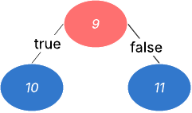
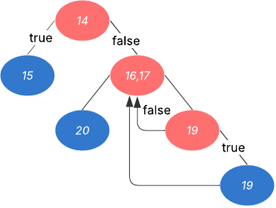

# Trabalho Prático - Estratégias de Teste com Pytest

## 1. Descrição do Framework (Pytest)

### 1.1 O que é o Pytest?

O **Pytest** é um framework de testes para **Python**, escolhemos utilizá-lo devido à sua simplicidade, flexibilidade e poder.
Ele permite escrever casos de teste de forma intuitiva, além de suportar **testes unitários, de integração e funcionais**. Sua sintaxe enxuta facilita a escrita e manutenção dos testes.

No nosso projeto, as funções principais geram exceções (`raise ValueError`) quando recebem dados inválidos, como valores fora do intervalo ou tipos errados. Com isso é possível identificar a causa do erro. Nos testes, usamos o **Pytest** para verificar se essas exceções realmente acontecem quando esperado. Assim, garantimos que o sistema está tratando erros corretamente.

### 1.2 Instalação e Integração

#### Instalação

1. **Primeiro, ative o ambiente virtual:**
   ```bash
   source .venv/bin/activate
   ```

2. **Depois instale o Pytest:**
   ```bash
   pip install pytest
   ```

3. **Para relatórios de cobertura (opcional):**
   ```bash
   pip install pytest-cov
   ```

#### Estrutura do Projeto

Para integrar ao projeto, seguimos a convenção do Pytest:

```
tp1-pytest/
├── CadeiaCaracteres.py          # Código fonte das funções
└── tests/                       # Pasta de testes
    ├── test_pe.py              # Testes de Partição de Equivalência
    ├── test_avl.py             # Testes de Análise de Valor Limite
    ├── test_causa_efeito.py    # Testes de Causa e Efeito
    └── test_estrutural.py      # Testes Estruturais
```

#### Execução dos Testes

**Pré-requisito:** Certifique-se de que o ambiente virtual está ativo:
```bash
source .venv/bin/activate
```

**Executar todos os testes:**
```bash
python -m pytest
```

**Executar com detalhes (verbose):**
```bash
python -m pytest -v
```

**Executar uma estratégia específica:**
```bash
python -m pytest tests/test_pe.py -v          # Apenas Partição de Equivalência
python -m pytest tests/test_avl.py            # Apenas AVL
python -m pytest tests/test_causa_efeito.py   # Apenas Causa e Efeito
python -m pytest tests/test_estrutural.py     # Apenas Teste Estrutural
```

**Executar com relatório de cobertura (requer pytest-cov):**
```bash
pip install pytest-cov                    # Instalar se necessário
python -m pytest --cov=CadeiaCaracteres   # Executar com cobertura
```

O Pytest irá automaticamente **descobrir e executar** todos os arquivos que começam com `test_` e funções que começam com `test_`.

## 2. Categorização do Framework

### 2.1 Técnicas de Teste

O **Pytest** suporta tanto técnicas de teste **caixa-preta** (focando em entradas e saídas) quanto **caixa-branca** (verificando o funcionamento interno do código). Em nosso projeto, utilizamos principalmente **técnicas de caixa-preta** como Partição de Equivalência e Grafo de Causa e Efeito.

### 2.2 Níveis de Teste

- **Teste Unitário:** testa funções/métodos isoladamente (principal foco do nosso projeto)

### 2.3 Tipos de Teste

- **Teste Funcional:** verifica se o sistema atende aos requisitos especificados 
- **Teste Estrutural:** verifica o comportamento interno do código, garantindo que todos os caminhos e condições da implementação sejam executados e funcionem corretamente.
- **Teste de Validação:** confirma se os dados de entrada são válidos
- **Teste de Exceção:** verifica o tratamento correto de erros e situações excepcionais

## 3. Nosso Problema

Considere um programa que solicita do usuário um inteiro positivo no intervalo entre **1 e 20** e então solicita uma cadeia de caracteres desse comprimento.
Após isso, o programa solicita um caractere e retorna a posição em que o caractere está presente na cadeia.
O usuário tem a opção de procurar vários caracteres.

### 3.1 Funções Implementadas

O sistema é composto por três funções principais implementadas no arquivo `CadeiaCaracteres.py`:

#### **validar_t(t)**
- **Propósito:** Valida se o valor de entrada é um inteiro no intervalo [1, 20]
- **Entrada:** `t` (valor a ser validado)
- **Saída:** `True` se válido
- **Exceções:** 
  - `ValueError("Valor não é inteiro")` para tipos não-inteiros
  - `ValueError("O número deve estar entre 1 e 20")` para valores fora do intervalo

#### **validar_cc(cc, t)**
- **Propósito:** Valida se a cadeia de caracteres possui exatamente o comprimento especificado
- **Entrada:** `cc` (cadeia de caracteres), `t` (tamanho esperado)
- **Saída:** `True` se a cadeia tem o tamanho correto
- **Exceção:** `ValueError("A cadeia deve ter exatamente {t} caracteres")` para tamanhos incorretos

#### **procurar_caractere(cc, c)**
- **Propósito:** Encontra todas as posições de um caractere em uma cadeia
- **Entrada:** `cc` (cadeia de caracteres), `c` (caractere a procurar)
- **Saída:** Lista com as posições onde o caractere foi encontrado (pode ser vazia)
- **Exceção:** `ValueError("Digite apenas um caractere")` se `c` não for exatamente 1 caractere

## 4. Estratégias de Teste

Para garantir uma **cobertura abrangente** e **eficiente** do sistema de validação de cadeias de caracteres, aplicamos **quatro estratégias complementares** de teste de caixa-preta:

- **Partição de Equivalência:** Divide entradas em classes equivalentes para reduzir casos de teste
- **Análise de Valor Limite (AVL):** Foca nos valores limites onde erros são mais prováveis  
- **Grafo de Causa e Efeito:** Modela relações lógicas entre entradas e saídas
- **Teste Estrutural:** Analisa cobertura de código e fluxos de execução

Cada estratégia oferece **perspectivas diferentes** e **complementares**, garantindo que o sistema seja testado de forma **sistemática** e **rigorosa**. A combinação dessas técnicas maximiza a **detecção de defeitos** enquanto otimiza o **número de casos de teste** necessários.

### 4.1 Partição de Equivalência

#### 4.1.1 O que é?

A **Partição de Equivalência** é uma técnica de teste de caixa-preta que divide o domínio de entrada em **classes de equivalência**, onde todos os elementos de uma mesma classe devem produzir comportamentos similares no sistema. O objetivo é reduzir o número de casos de teste necessários, escolhendo **representantes** de cada partição.

#### 4.1.2 Partições Identificadas

Para nosso problema, identificamos as seguintes partições:

##### **validar_t(t) - Validação do Tamanho**

**Partições:**
- **Inteiros válidos (1-20)**: valores dentro do intervalo permitido
- **Inteiros inválidos (<1)**: valores abaixo do limite inferior  
- **Inteiros inválidos (>20)**: valores acima do limite superior
- **Não-inteiros**: tipos diferentes de int (float, string, None)

##### **validar_cc(cc, t) - Validação da Cadeia**

**Partições:**
- **Tamanho correto**: cadeia com comprimento exatamente igual a `t`
- **Tamanho menor**: cadeia com comprimento menor que `t`
- **Tamanho maior**: cadeia com comprimento maior que `t`

##### **procurar_caractere(cc, c) - Busca de Caractere**

**Partições:**
- **Caractere válido - uma ocorrência**: encontra o caractere uma vez
- **Caractere válido - múltiplas ocorrências**: encontra o caractere várias vezes
- **Caractere válido - nenhuma ocorrência**: não encontra o caractere na cadeia
- **Caractere inválido - string vazia**: entrada com ""
- **Caractere inválido - múltiplos caracteres**: entrada com mais de 1 caractere

#### 4.1.3 Casos de Teste Implementados

| T  | CC      | C  | Tamanho Esperado | Saída Esperada                                    |
| -- | ------- | -- | ---------------- | ------------------------------------------------- |
| 1  | -       | -  | -                | True                                              |
| 10 | -       | -  | -                | True                                              |
| 20 | -       | -  | -                | True                                              |
| 0  | -       | -  | -                | O número deve estar entre 1 e 20                 |
| -5 | -       | -  | -                | O número deve estar entre 1 e 20                 |
| 21 | -       | -  | -                | O número deve estar entre 1 e 20                 |
| 25 | -       | -  | -                | O número deve estar entre 1 e 20                 |
| 3.14 | -     | -  | -                | Valor não é inteiro                               |
| "10" | -     | -  | -                | Valor não é inteiro                               |
| None | -     | -  | -                | Valor não é inteiro                               |
| 3  | abc     | -  | 3                | True                                              |
| 0  | ""      | -  | 0                | True                                              |
| 6  | python  | -  | 6                | True                                              |
| 3  | ab      | -  | 3                | A cadeia deve ter exatamente 3 caracteres        |
| 1  | ""      | -  | 1                | A cadeia deve ter exatamente 1 caracteres        |
| 5  | test    | -  | 5                | A cadeia deve ter exatamente 5 caracteres        |
| 3  | abcd    | -  | 3                | A cadeia deve ter exatamente 3 caracteres        |
| 5  | python  | -  | 5                | A cadeia deve ter exatamente 5 caracteres        |
| 4  | hello   | -  | 4                | A cadeia deve ter exatamente 4 caracteres        |
| -  | python  | p  | -                | [0]                                               |
| -  | hello   | h  | -                | [0]                                               |
| -  | abc     | c  | -                | [2]                                               |
| -  | banana  | a  | -                | [1, 3, 5]                                        |
| -  | hello   | l  | -                | [2, 3]                                           |
| -  | ababa   | b  | -                | [1, 3]                                           |
| -  | python  | z  | -                | []                                                |
| -  | abc     | x  | -                | []                                                |
| -  | hello   | w  | -                | []                                                |
| -  | abc     | "" | -                | Digite apenas um caractere                        |
| -  | abc     | xy | -                | Digite apenas um caractere                        |
| -  | test    | ab | -                | Digite apenas um caractere                        |
---

##### Legenda:

- **T** = Valor de entrada para o tamanho/campo numérico
- **CC** = Cadeia de caracteres
- **C** = Caractere procurado
- **Tamanho Esperado** = Parâmetro para validar o tamanho da cadeia (quando aplicável)
- **Saída Esperada** = Resultado ou mensagem de erro esperada

### 4.2 Análise de Valor Limite (AVL)

A **Análise de valor limite** é uma técnica de caixa preta que verifica valores logo abaixo, no limite e logo acima dos intervalos válidos, com o obejtivo de achar defeitos nas bordas, com poucos casos de teste

#### validar_t(t)
| Categoria                      | Valor testado | 
| ------------------------------ | ------------: | 
| **Um abaixo do limite**        |       0       | 
| **Limite inferior**            |       1       |
| **Um a mais do inferior**      |       2       | 
| **Um a menos do superior**     |       19      | 
| **Limite superior**            |       20      | 
| **Um a mais acima do limite**  |       21      | 


#### validar_cc(cc, t)
t = 1

| Categoria | cc | Resultado esperado |
| --------- | ---: | ------------------ |
| t − 1     |    0 | exceção            |
| t         |    1 | válido             |
| t + 1     |    2 | exceção            |


t = 10

| Categoria | cc | Resultado esperado |
| --------- | ---: | ------------------ |
| t − 1     |    9 | exceção            |
| t         |   10 | válido             |
| t + 1     |   11 | exceção            |


t = 20

| Categoria | cc | Resultado esperado |
| --------- | ---: | ------------------ |
| t − 1     |   19 | exceção            |
| t         |   20 | válido             |
| t + 1     |   21 | exceção            |


#### procurar_caractere(cc, c)

Limites por posição - onde c aparece

| Categoria             | Exemplo        | Índice(s) |
| --------------------- | -------------- | --------: |
| **Primeiro elemento** | `("abc", "a")` |       [0] |
| **Último elemento**   | `("abc", "c")` |       [2] |
| **String unitária**   | `("a", "a")`   |       [0] |
| **String vazia**      | `("", "a")`    |        [] |

Limites por tamanho de c - se c é válido

| Categoria               | Valor de `c` | Resultado esperado |
| ----------------------- | ------------ | ------------------ |
| **Vazio (c = 0)**     | `""`         | exceção            |
| **Válido (c = 1)**    | `"a"`        | busca normal       |
| **Múltiplos (c > 1)** | `"ab"`       | exceção            |


### 4.3 Grafo de Causa e Efeito

#### 4.3.1 O que é?

O **Grafo de Causa e Efeito** é uma técnica formal de derivação de casos de teste baseada em **lógica booleana**.
Ela modela as relações entre **entradas (causas)** e **saídas (efeitos)** do sistema, permitindo identificar combinações relevantes para teste.
A partir desse grafo, é possível construir **tabelas de decisão** que orientam a criação dos casos de teste.


#### 4.3.2 Causas e Efeitos

**Causas:**

1. Inteiro positivo no intervalo de 1 a 20
2. Caractere a ser procurado na cadeia
3. Procurar outro caractere

**Efeitos:**

- **20.** Inteiro fora do intervalo
- **21.** Posição do caractere na cadeia
- **22.** Caractere não encontrado
- **23.** Término do programa

#### 4.3.3 Tabela de Decisão (Grafo Causa-Efeito)

|    |   |   |   |   |
| -- | - | - | - | - |
| 1  | 0 | 1 | 1 | - |
| 2  | - | 1 | 0 | - |
| 3  | - | 1 | 1 | 0 |
| 20 | 1 | 0 | 0 | 0 |
| 21 | 0 | 1 | 0 | 0 |
| 22 | 0 | 0 | 1 | 0 |
| 23 | 0 | 0 | 0 | 1 |

#### 4.3.4 Casos de Teste Derivados

| T  | CC      | C  | Tamanho Esperado | Saída Esperada                                    |
| -- | ------- | -- | ---------------- | ------------------------------------------------- |
| 23 | -       | -  | -                | O número deve estar entre 1 e 20                  |
| 0  | -       | -  | -                | O número deve estar entre 1 e 20                  |
| a  | -       | -  | -                | Valor não é inteiro                               |
| 5  | -       | -  | -                | True                                              |
| 4  | abc     | -  | 4                | A cadeia deve ter exatamente 4 caracteres         |
| 4  | abcd    | -  | 4                | True                                              |
| -  | abc     | c  | -                | [2]                                               |
| -  | abacada | a  | -                | [0, 2, 4, 6]                                      |
| -  | abc     | x  | -                | []                                                |
| -  | abc     | xy | -                | Digite apenas um caractere                        |
| -  | abc     | -  | -                | Digite apenas um caractere                        |
| -  | -       | -  | -                | *(Término do programa, não testável diretamente)* |

---

##### Legenda:

- **T** = Valor de entrada para o tamanho/campo numérico
- **CC** = Cadeia de caracteres
- **C** = Caractere procurado
- **Tamanho Esperado** = Parâmetro para validar o tamanho da cadeia (quando aplicável)
- **Saída Esperada** = Resultado ou mensagem de erro esperada

Cada linha da tabela acima foi um teste implementado no código apresentado, cobrindo as principais possibilidades de entradas e suas respectivas saídas, conforme a modelagem do grafo de causa e efeito.

O caso de término do programa (**23**) depende do controle de fluxo externo, **não sendo testável diretamente** nas funções fornecidas, mas está documentado para fins de cobertura da modelagem.

Os testes implementados cobrem **validação de entrada, tamanho da cadeia, busca de caracteres, casos de erro e sucesso**, conforme a estratégia formal definida.

### 4.4 Teste Estrutural

#### 4.4.1 O que é?
**Teste estrutural (ou white-box)** é uma técnica de teste que olha “por dentro” do código para validar sua lógica. A partir da estrutura interna, criamos casos de teste para cobrir instruções, decisões e caminhos, verificando fluxos de controle e de dados. Isso ajuda a achar código não executado, tratar melhor condições de borda e reduzir erros, aumentando a confiabilidade e a facilidade de manutenção do sistema.

#### 4.4.2 CFG (Control Flow Graph)

##### Validar entrada de número de caracteres - validar_t(t)


| CFG | Código |
|---|---|
|  |  |


##### Validar entrada de caracteres corresponde ao número passado - validar_cc(cc, t)


| CFG | Código |
|---|---|
|  |  |


##### Retronar posição(ões) em que a entrada/letra esta contida na palavra - procurar_caractere(cc, c)

| CFG | Código |
|---|---|
|  |  |

#### 4.4.3 Complexidade Ciclomática

Use V(G) = P + 1, onde P é o nº de nós predicados (if/for)

| Função | Predicados (P) | V(G) |
| ------ | -------------- | ---- |
| validar_t | if not isinstance, if not(1..20) | 3 |
| validar_cc | if len(cc) != t | 2 |
| procurar_caractere | if len(c)!=1, for, if ch==c | 4 |

#### 4.4.4 Caminhos-base

| Função | Caminho | Entrada | Saída esperada |
| ------ | ------- | ------- | -------------- |
| validar_t | 2-3 | "10" | ValueError("Valor não é inteiro") |
| validar_t | 2-4-5 | 0, 21, -5 | ValueError("O número deve estar entre 1 e 20") |
| validar_t | 2-4-6 | 1, 20, 5 | True |
| validar_cc | 9-10 | ("ab",3), ("abcd",3), ("",1) | ValueError(f"... {t} ...") |
| validar_cc | 9-11 | ("abc",3) | True |
| procurar_caractere | 14-15 | ("teste",""), ("teste","ab") | ValueError("Digite apenas um caractere")|
| procurar_caractere | 14-[16,17]-20 | ("", "x") | [] |
| procurar_caractere | 14-[16,17]-18 | ("abcde","z") | [] |
| procurar_caractere | 14-[16,17]-18-19 | ("banana","a") | [1,3,5] |

#### 4.4.5 Casos de Teste

Os casos de teste foram gerados com base nos caminhos-base definidos na Etapa 3, garantindo a execução de todos os ramos (incluindo a validação das exceções e mensagens).

## 5. Resultados dos Testes

#### Demonstrações da Execução

**Execução dos testes:**


**Execução com cobertura de código:**


**Execução partição de equivalência:**


**Execução AVL:**


**Execução grafo causa e efeito:**


**Execução teste estrutural:**


### 5.1 Resumo da Execução

O projeto implementa **90 casos de teste** distribuídos entre as diferentes estratégias:

```
tests/test_avl.py .........................                                                           [ 27%]
tests/test_causa_efeito.py ............                                                               [ 41%]
tests/test_estrutural.py ......................                                                       [ 65%]
tests/test_pe.py ...............................                                                      [100%]
============================================ 90 passed in 0.44s =============================================
```

### 5.2 Cobertura de Código

A execução dos testes alcança **100% de cobertura** do código fonte:

```
Name                  Stmts   Miss  Cover
-----------------------------------------
CadeiaCaracteres.py      18      0   100%
-----------------------------------------
TOTAL                    18      0   100%
```

#### Detalhamento por Estratégia:

- **Análise de Valor Limite (AVL):** 25 testes (0% → 27%)
- **Causa e Efeito:** 12 testes (27% → 41%)  
- **Teste Estrutural:** 22 testes (41% → 65%)
- **Partição de Equivalência:** 31 testes (65% → 100%)

#### Métricas de Qualidade:

- **90/90 testes passando** (100% de sucesso)
- **18/18 linhas cobertas** (100% de cobertura)
- **0 falhas detectadas**
- **Todas as funções testadas**: `validar_t`, `validar_cc`, `procurar_caractere`
- **Todas as estratégias implementadas**: PE, AVL, Causa-Efeito, Estrutural

### 5.3 Resumo Final

**Resultados Alcançados:**
- **90 casos de teste** implementados
- **100% de cobertura** de código
- **4 estratégias** de teste aplicadas: PE, AVL, Causa-Efeito, Estrutural
- **Tempo de execução:** ~0.44 segundos
